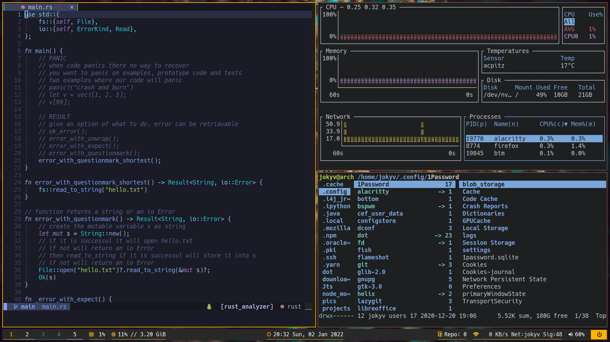

## All my dot files and scripts

### Common Packages

- Terminal: alacritty
- Editor: helix
- Prompt: starship
- Icons: Nerd Font
- Mens: Rofi
- Colorscheme: rose-pine
- Browsers: brave, chromium
- Filemanager: Thunar
- Compositor: picom
- Status Bar: Qtile
- Sreenshots: flameshot

### QTILE

...to be continued

### BSPWM



### Instalation

```bash
git clone https://github.com/jokyv/dotfiles.git ~/repos/dot
```

### Roadmap

- [x] version 2.x
  - improving dotfiles
  - improving scripts
  - documentation - README.md
  - stabilise everything before moving to wayland and new wm
- [x] version 3.0
  - [x] move to qtile
  - [x] move away from x11 wm such as bspwm
- [ ] version 4.0
  - move to wayland
  - replace x11 apps with wayland apps
- [ ] version 5.0
  - wayland with hyprland or qtile option
  - replace ranger with rust based file manager
- [ ] version 6.0
  - [ ] merge arch installation and dotfiles
